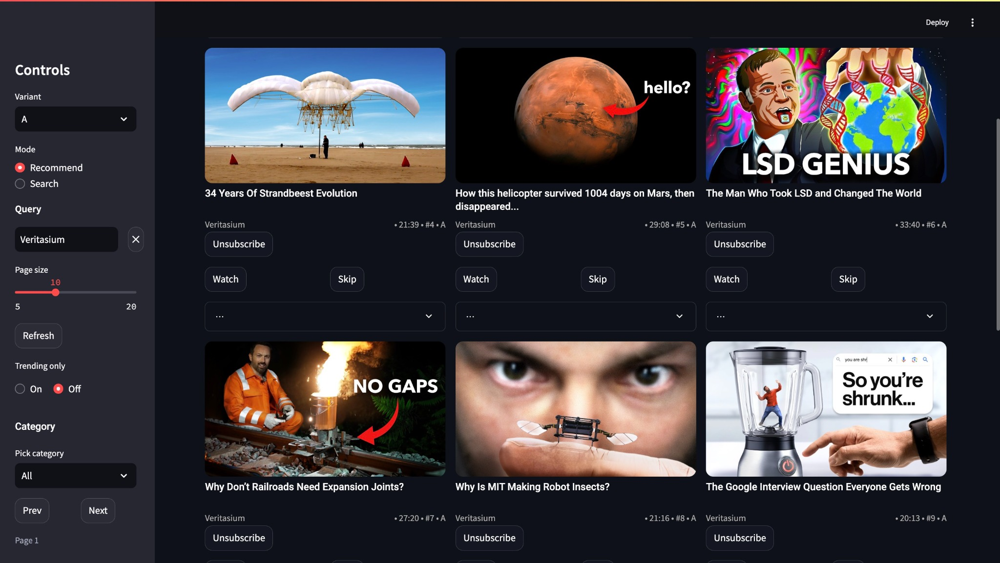
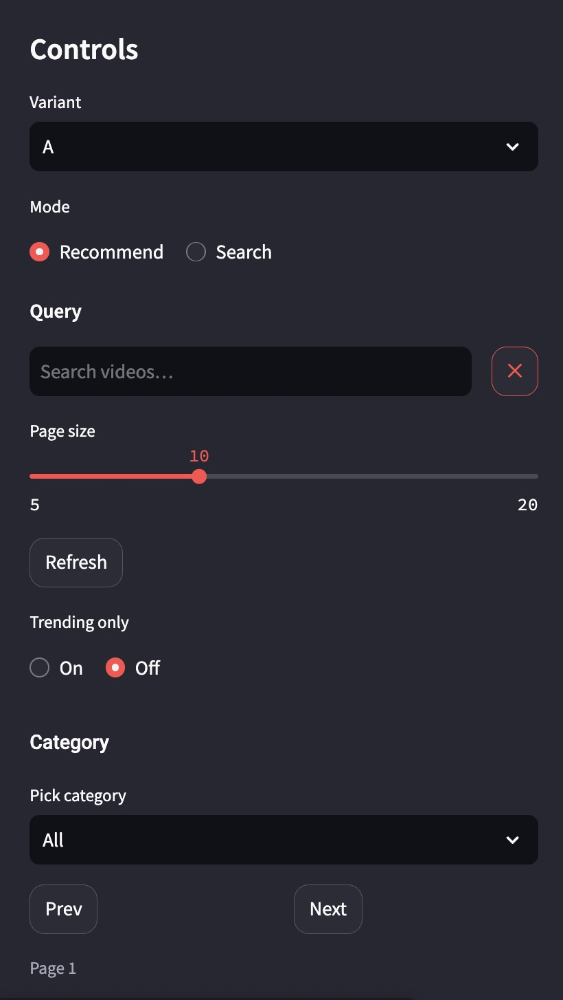
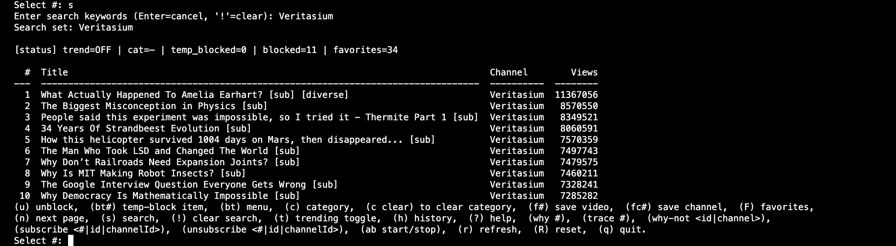
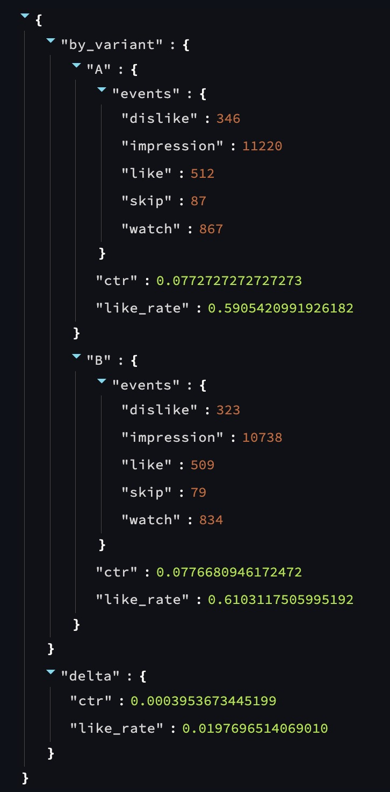

# YouTube Recommendation System

> **TL;DR**: Two‑stage YouTube recommender (LightFM candidates → TFRS ranker) with CLI + FastAPI + UI, realtime personalization (favorites/blocks/filters), Shorts filtering, and offline evaluation (Recall@K / NDCG / MAP). Designed for portfolio‑quality clarity and reproducibility.

<p align="center">
  
</p>

<p align="center">
  
</p>

---

## Features

- **Two‑stage pipeline**
  - **Candidate generation:** LightFM collaborative filtering, augmented with content similarity (titles + hashtags).
  - **Ranking:** TensorFlow Recommenders (TFRS) hybrid user/item embeddings with contextual features.
- **Signals & personalization**
  - Uses **30–50** most‑recent watch‑history items with **recency decay**.
  - Incorporates video **hashtags** when available.
  - **Excludes Shorts** via configurable minimum duration.
- **Realtime interactivity**
  - Recommendations **recompute after each action** (like, block, favorite, filter change).
- **User controls (CLI & UI & API)**
  - **Favorites** (videos/channels), **permanent blocks**, **temporary session blocks**.
  - **Filters:** category, trending/new, long‑video only.
- **Service + UI**
  - **FastAPI** backend with `/docs` (Swagger) and a lightweight UI (Streamlit).
  - **CLI** for power users.
- **Reproducible & portable**
  - **Docker** images for API and UI, **MLflow** for experiment tracking.

---

## Architecture

```
+-----------------------+       +--------------------+
|  Watch History (CSV)  |       |  Subscriptions CSV |
+-----------+-----------+       +---------+----------+
            |                             |
            v                             v
        [Data ingest]  -->  SQLite/Parquet/Cache  <--  [Categories/Trending backfill]
                               |
                               v
        +---------------- Candidate Generation ----------------+
        | LightFM (CF) + content sim (titles/hashtags)        |
        +-----------------------------+------------------------+
                                      |
                                      v
                    +------------- Ranking (TFRS) -------------+
                    | Hybrid user/item embeddings + features   |
                    +--------------------+---------------------+
                                         |
                                         v
                      FastAPI (/recs, /control/*) + CLI + UI
```

---

## Repository Layout (typical)

```
api/
  main.py
  schemas.py
  service.py
data/                     # not pushed to GitHub 
  subscriptions.csv       # get from 
  watch_history.csv
  app.db                  # if using SQLite
docker/
  Dockerfile.api
  Dockerfile.ui
docs/img
  ab_report.jpg
  ui_controls.jpg
  ui_grid.jpg
src/
  dl/
    embed_text.py
    nn_reranker.py
  backfill_categories.py
  categories.py
  cf_recs.py              # LightFM candidates
  config.py
  embeds_faiss.py
  expand_from_history.py
  experiments.py
  feats.py
  fetch_subs_uploads.py
  import_subscriptions.py
  import_takeout.py
  main.py                 # CLI entry
  ranker.py
  recommender.py
  resolve_channel.py
  store.py
  utils.py
  youtube.py
tools/
  tools/backfill_tags.py
ui/
  app.py
.env.public
.gitignore
Makefile
README.md
docker-compose.yml
requirements.txt
```

---

## Configuration

Create a `.env` (or use environment variables):

```bash
# YouTube Data API
YT_API_KEY=YOUR_KEY

# Personalization & filtering
REGION=US
USE_SUBS=1
USE_CF=lightfm
LONG_MIN_SEC=180    # Shorts exclusion threshold (seconds)
PAGE_MEMORY=10
NN_RERANK=1         # enable neural re‑ranking (TFRS)

# MLflow (optional)
MLFLOW_TRACKING_URI=mlruns
DB_PATH=data/app.db
```

### Env var reference

| Key | Required | Default | Purpose |
|---|---|---|---|
| `YT_API_KEY` | Yes | – | YouTube Data API key |
| `REGION` | No | `US` | Market/region for trends/categories |
| `USE_SUBS` | No | `1` | Bias towards channels you subscribe to |
| `USE_CF` | No | `lightfm` | Candidate generator backend |
| `NN_RERANK` | No | `1` | Enable TFRS neural re‑ranker |
| `LONG_MIN_SEC` | No | `180` | Exclude Shorts below this length |
| `PAGE_MEMORY` | No | `10` | CLI paging memory |
| `DB_PATH` | No | `data/app.db` | SQLite database path (if used) |
| `MLFLOW_TRACKING_URI` | No | `mlruns` | Local MLflow store |

---

## Quickstart

### 1) Python environment

```bash
python3 -m venv .venv
source .venv/bin/activate
pip install -r requirements.txt
cp .env.example .env  # then edit with your values
```

> macOS note: If LightFM warns about OpenMP, it still works single‑threaded. For parallelism, install compilers with OpenMP support (optional).

### 2) Seed data (optional but recommended)

```bash
# Import your YouTube subscriptions (CSV)
export PYTHONPATH="$(pwd)"
python -m src.import_subscriptions data/subscriptions.csv

# Backfill categories/trending metadata
python -m src.backfill_categories
```

### 3) Run the **CLI**

```bash
export PYTHONPATH="$(pwd)"
python -m src.main
```

**CLI controls (examples):**  
(u) unblock,  (bt#) temp-block item,  (bt) menu,  (c) category,  (c clear) to clear category,  (f#) save video,  (fc#) save channel,  (F) favorites,
(n) next page,  (s) search,  (!) clear search,  (t) trending toggle,  (h) history,  (?) help,  (why #),  (trace #),  (why-not <id|channel>),
(subscribe <#|id|channelId>),  (unsubscribe <#|id|channelId>),  (ab start/stop),  (r) refresh,  (R) reset,  (q) quit.

<p align="center">
  
</p>

### 4) Run the **API**

```bash
export PYTHONPATH="$(pwd)"
uvicorn api.main:app --host 127.0.0.1 --port 8000 --reload
```

Open **Swagger**: `http://127.0.0.1:8000/docs`

**Quick curl examples**
```bash
# Health
curl -s http://127.0.0.1:8000/health

# Get recs (example)
curl -s "http://127.0.0.1:8000/recs?user_id=local&k=10" | jq '.items[0:3]'
```

### 5) Docker (API + UI)

```bash
# Build
docker build -t yt-recs-api -f docker/Dockerfile.api .
docker build -t yt-recs-ui  -f docker/Dockerfile.ui  .

# Run (example)
docker run --rm -p 8000:8000 --env-file .env yt-recs-api
docker run --rm -p 3000:3000 yt-recs-ui
```

You can also expose env vars with `-e KEY=VALUE` if you prefer not to mount `.env`.

---

## Evaluation

Offline evaluation (example command):

```bash
python -m src.eval_offline --k 10 --split loo --report out/offline_metrics.json
```

**Example results (from A/B variant log excerpt):**

- Variant **A** — CTR: `0.0773`, Like‑rate: `0.5905`  
- Variant **B** — CTR: `0.0777`, Like‑rate: `0.6103`  
- **Delta** — CTR: `+0.00040`, Like‑rate: `+0.0198`

<p align="center">
  
</p>

> Use these as illustrative numbers; your results will vary by history and settings.

If using MLflow:
```bash
mlflow ui --backend-store-uri mlruns
```

---

## Makefile (if present)

```bash
make install     # pip install -r requirements.txt
make api         # run uvicorn API
make ui          # run UI
make test        # run tests
make lint        # format/lint
```

---

## Roadmap

- Content embeddings (sentence‑transformers) to enrich content features
- Vector store for ANN candidate lookup
- Shorts detection improvements (duration + metadata + aspect ratio)
- Ranker upgrades (pairwise losses, hard‑negative mining)
- Online eval + configurable A/B switches via API
- Batch + streaming ingestion; background sync jobs
- CI/CD, pre‑commit hooks, unit tests expansion

---

## Data & Privacy

- Uses the **YouTube Data API**; comply with Google’s Terms of Service and quotas.
- Stores minimal local data (e.g., favorites/blocks in SQLite).  
  Delete by removing `data/app.db`, `data/` caches, or resetting the project directory.
- Not affiliated with YouTube/Google.

---

## License

**MIT** — see [LICENSE](./LICENSE).

---

## Acknowledgments

- **LightFM** (Collaborative Filtering)
- **TensorFlow Recommenders**
- **FastAPI**, **Uvicorn**
- **MLflow**
